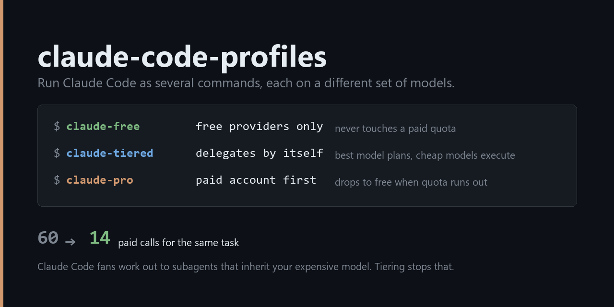

<p align="center">
  
</p>

# Claude Code profiles

Run Claude Code as **several separate commands**, each wired to a different set of models.

```
claude-free      free providers only, never touches a paid quota
claude-tiered    delegates by itself: best model plans, cheap models execute
claude-pro       your paid account first, drops to free when the quota runs out
```

Each is a real, isolated Claude Code profile with its own history, settings, and session list. Your normal `claude` command is left alone.

Add, remove, or rename profiles by editing one JSON file and re-running the installer.

### The problem it solves

Claude Code fans work out to subagents on its own. Those subagents use whatever your `haiku` and `sonnet` aliases point at — so if every alias points at your expensive model, **every subagent is expensive**, and you never see it happen.

Measured on one volume task: a single-model setup made **60 paid Opus calls**. The same task with three tiers made **14**. ([full numbers](MEASUREMENTS.md))

You don't need this project to act on that — plain Claude Code has `ANTHROPIC_DEFAULT_HAIKU_MODEL` and `CLAUDE_CODE_SUBAGENT_MODEL`, and pointing either somewhere cheaper captures most of the effect. This just makes it a set of commands you can switch between.

---

## Is this the tool you want?

Probably worth reading before you install anything.

If you want **one Claude Code that routes each request to a different model**, use [claude-code-router](https://github.com/musistudio/claude-code-router) instead — 36k stars, MIT, actively maintained, and it does that job properly.

This project solves a narrower problem: **keeping several routing strategies side by side as separate commands**, so "burn my paid quota on hard work" and "use free models for bulk work" are two different things you type, not one config you keep editing. It also does two things I haven't found elsewhere:

- **Tier delegation.** Claude Code's `opus`/`sonnet`/`haiku` aliases are pointed at *three different model chains*, and subagents pin themselves to a tier. One prompt then spreads across three price points automatically. ([How](#the-delegating-profile))
- **Model verification.** Routers advertise models their upstream accounts can't actually serve. `-TestModels` calls every model once and tells you which are dead. On the setup this was built for, **5 of 18 advertised models were unusable** — and the failures were invisible, because fallback chains hid them behind extra latency.

It builds on [OmniRoute](https://www.npmjs.com/package/omniroute) as the gateway rather than shipping its own proxy.

---

## Does it actually help?

Measured, not claimed — one run each of two tasks, counted from the gateway's own call logs. Full method and caveats in [MEASUREMENTS.md](MEASUREMENTS.md).

**Small task** (read 8 files, build a table):

| | Time | Paid calls | Paid input tokens |
|---|---|---|---|
| single expensive model | **21 s** | **3** | **112,884** |
| `claude-tiered` | 100 s | 6 | 208,855 |

Tiering **lost on every axis**. Not enough work to spread, so the dispatch overhead swamped the saving. Don't use it for small jobs.

**Volume task** (read and judge 20 documents individually):

| | Time | Paid calls | Paid input tokens |
|---|---|---|---|
| single expensive model | **155 s** | 60 | 3,305,563 |
| `claude-tiered` | 529 s | **14** | **678,897** |

4.9x fewer paid tokens, 4.3x fewer paid calls, 3.4x slower.

### Why

Claude Code fans work out to subagents on its own. Those subagents use whatever the `haiku` and `sonnet` aliases point at — so if every alias points at your expensive model, **every subagent is expensive**. On the volume task that meant 60 paid Opus calls instead of 14.

You don't need this project to act on that: plain Claude Code has `ANTHROPIC_DEFAULT_HAIKU_MODEL` and `CLAUDE_CODE_SUBAGENT_MODEL`, and pointing either somewhere cheaper captures most of the effect.

**Single runs on one machine.** Your numbers will differ. And "free" isn't unlimited — the volume task pushed 1.8 M tokens onto free accounts, which have their own limits. Consumption moves; it doesn't disappear.

---

## Requirements

- **Claude Code**, installed and working
- **Windows**, **macOS**, or **Linux**
- **At least one provider account.** Several need no signup at all.

Node.js is required for the gateway; the installer offers to install it if missing.

### What gets installed

| | |
|---|---|
| Node.js | only if missing, only after you say yes |
| OmniRoute | the gateway — **~2.3 GB**, a few minutes, no progress output |
| `~/.omniroute/` | its database, logs, and your provider credentials |
| `~/.claude-*/` | one directory per profile |

The gateway runs in the background. It does **not** start at boot on Windows, so the profile commands start it on demand — expect `starting the model router...` and a few seconds' delay on the first command after a reboot.

## Install

**Windows:**
```powershell
powershell -ExecutionPolicy Bypass -File .\install.ps1
```

**macOS / Linux:**
```bash
./install.sh
```

It checks prerequisites, installs and starts the gateway, then **pauses** at the dashboard for the one part only you can do: add your providers and create an API key. Most providers are OAuth — you click "sign in", exactly like logging into a website. Then paste the key back and it builds everything and tests each profile end to end.

Then reload your shell — `. $PROFILE` on Windows, `source ~/.zshrc` (or `~/.bashrc`) elsewhere. The installer prints the exact path.

Re-running is safe. It replaces its own managed block rather than stacking duplicates, never overwrites a profile's chat history, and leaves an edited `CLAUDE.md` alone.

### Other modes

```powershell
.\install.ps1 -ListModels    # what your account actually exposes, grouped by provider
.\install.ps1 -TestModels    # call every model in profiles.json, report which are dead
.\install.ps1 -DryRun        # show what would be built, write nothing
```
```bash
./install.sh --list-models
./install.sh --test-models
./install.sh --dry-run
```

`-ListModels` then `-TestModels` is the fastest way to fill in `profiles.json` for your own accounts.

---

## How it works

Claude Code only ever asks for one of four model aliases — `opus`, `sonnet`, `haiku`, `fable`. Environment variables decide what each one means:

```
Claude Code  ──"give me opus"──>  gateway  ──"that means tier-heavy"──>  a real model
```

A **combo** is an ordered list of real models plus a strategy:

- `priority` — always start at the top, walk down only on failure
- `round-robin` — spread calls evenly across the list

A **profile** is a config directory plus a mapping of those aliases onto combos. Because each profile is a separate `CLAUDE_CONFIG_DIR`, they keep their own history and settings and can't interfere with each other.

### The delegating profile

`claude-tiered` points the aliases at *three different* combos:

```
opus   ->  tier-heavy   the best model you have
sonnet ->  tier-mid     free, decent
haiku  ->  tier-cheap   free, fast
```

Then four subagents pin themselves to a tier with one line of frontmatter:

```markdown
---
name: executor
model: haiku      # <- this is the whole mechanism
---
```

| Agent | Tier | Job |
|---|---|---|
| `researcher` | heavy | synthesis across many sources |
| `verifier` | mid | checks work the cheap tier produced |
| `executor` | cheap | applies changes already specified exactly |
| `screener` | cheap | classify / extract, one document at a time |

`templates/CLAUDE.md` tells the main model when to hand off. So *"screen these 40 abstracts, then build the table"* becomes: the expensive model decides the criteria, forty cheap calls do the screening, a cheap call writes the table, a mid call checks it, and the expensive model writes the answer. One prompt, most of the work free.

Each subagent also gets its **own context window**, so those 40 documents never enter your main conversation — often worth more than the cost saving.

**This is guidance, not a hard router.** The main model reads the policy and decides. It usually complies; on small tasks it may just do the work itself. To force it: *"delegate the screening to `screener`."*

---

## Customizing

Edit **`profiles.json`**, re-run the installer. That's the whole workflow.

### Connecting your own models

The shipped `profiles.json` is **an example built around one person's accounts** — it will not match yours. The three-step loop:

**1. See what you actually have.**

```powershell
.\install.ps1 -ListModels     # or: ./install.sh --list-models
```

Prints every model your providers expose, grouped, e.g. `myprovider/some-model-v2`. Add more providers in the dashboard first if the list looks thin.

**2. Put them in `profiles.json`.** Each combo is an ordered list; first entry is tried first, the rest are fallbacks:

```json
{ "name": "tier-cheap", "strategy": "priority",
  "models": ["fast-provider/small-model", "other-provider/backup-model"] }
```

**3. Verify they actually work.**

```powershell
.\install.ps1 -TestModels     # or: ./install.sh --test-models
```

This calls each one once. **Do not skip it.** A router's catalog lists what its providers *advertise*, not what your account can serve — on the setup this was built for, 5 of 18 advertised models returned `INVALID_MODEL_ID` on every request. Because fallback chains retry silently, the only symptom was latency. Remove anything it flags, then run the installer.

Models you don't have are dropped automatically with a warning, and a profile is skipped only if its whole combo ends up empty, so a partial match still installs cleanly.

**Add a profile:**

```json
{
  "command": "claude-cheap",
  "dir": ".claude-cheap",
  "summary": "Delegating, but free all the way down.",
  "slots": { "opus": "free-stack", "sonnet": "tier-mid", "haiku": "tier-cheap" },
  "extraArgs": [],
  "delegation": true
}
```

`command` is what you type. `dir` is its config folder under your home directory — give each profile its own. `delegation: true` installs the agents and the policy file.

**Change delegation behaviour** — edit `templates/CLAUDE.md` or `templates/agents/*.md`, then re-run. You can also edit `~/.claude-tiered/CLAUDE.md` directly; the installer won't overwrite it once changed. Agent files *are* refreshed on every run, so make lasting agent changes in `templates/`.

**Move the gateway port** — change `gateway.port`.

---

## Uninstall

```powershell
powershell -ExecutionPolicy Bypass -File .\uninstall.ps1
```
```bash
./uninstall.sh
```

Removes the commands, keeps your config folders and history. Add `-RemoveConfigs` / `--remove-configs` to delete those too. Node, the gateway, your logins and your normal `claude` are never touched.

## Troubleshooting

**`claude-free` isn't recognized** — reload with `. $PROFILE`.

**"That key was rejected"** — the key must come from *your* dashboard at `http://localhost:20128/dashboard`. Keys are per-machine.

**A tier feels slow** — run `-TestModels`. A model that consistently fails still gets tried first on every request, and the fallback hides it behind extra latency. Remove dead entries from `profiles.json`.

**A profile got skipped** — its combo had none of your models. Add that provider, or edit `profiles.json`.

**`[claude-code:unrecognized_model]`** — harmless. Claude Code doesn't recognise combo names.

**Check what's active** — `Get-OmniProfile` prints the current config dir and tier mapping.

## Platform support

| | Installer | Shell profile | Tested |
|---|---|---|---|
| Windows | `install.ps1` | `Microsoft.PowerShell_profile.ps1` | yes, extensively |
| macOS / Linux | `install.sh` | `~/.zshrc`, `~/.bashrc`, or `~/.profile` | logic tested under bash 5 on Windows; **not yet run on a real mac or Linux box** |

`install.sh` targets **bash 3.2** (what macOS still ships) — no associative arrays, no `mapfile`. JSON is handled by `node`, which you already need for the gateway, so there is no `jq` dependency.

It was exercised against a live gateway: dry-run, model listing, model testing, a full install into a sandbox `HOME`, launcher sourcing, a real Claude Code round-trip, an idempotent re-install, and uninstall both with and without `--remove-configs`. What has **not** happened is a run on actual macOS or Linux. If you hit something there, an issue with the error text is genuinely useful.

## Notes

- **Everything runs locally.** The gateway is on your machine; traffic goes only to the providers you signed into.
- **Your API key is stored in plaintext** in each `~/.claude-*/settings.json`, as most CLI tools store tokens. Don't commit those folders.
- **Cheap models are weaker at tool use.** That's why `executor` returns `BLOCKED` rather than guessing, and why `verifier` exists. Treat cheap-tier output as a draft.
- **Round-robin defeats prompt caching.** Cache is per-model; alternating providers guarantees a miss on every request. Use `priority` if cache matters more than spreading load.
- **Routing a paid subscription through a third-party gateway may conflict with that provider's terms.** Check what your plan allows.
- **Free providers are third-party accounts.** Don't send anything confidential through them.

## License

MIT
